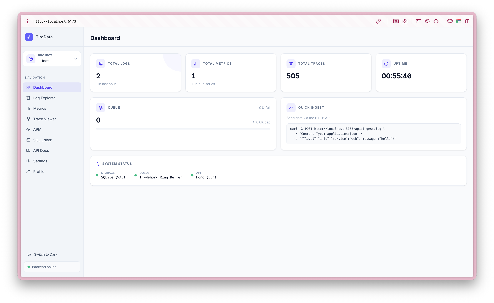
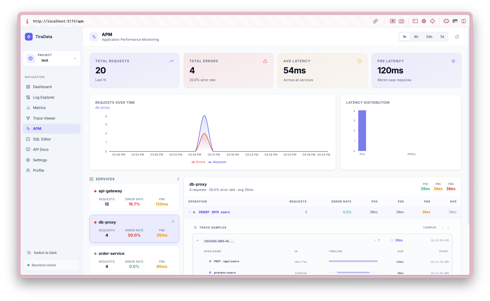
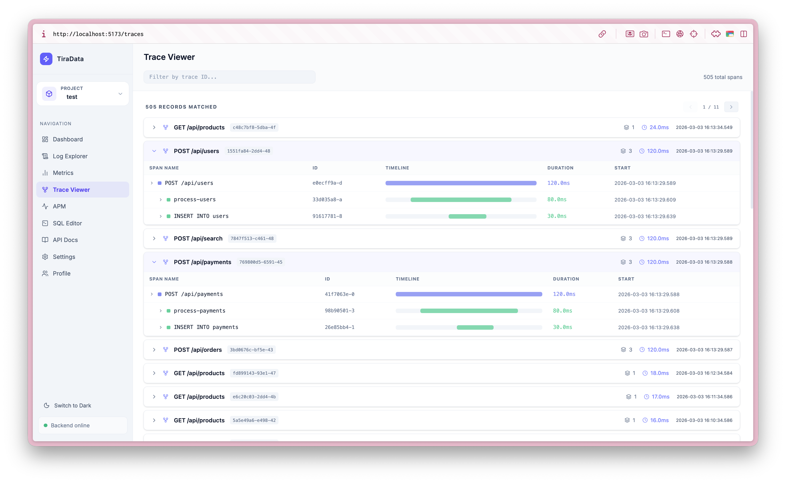
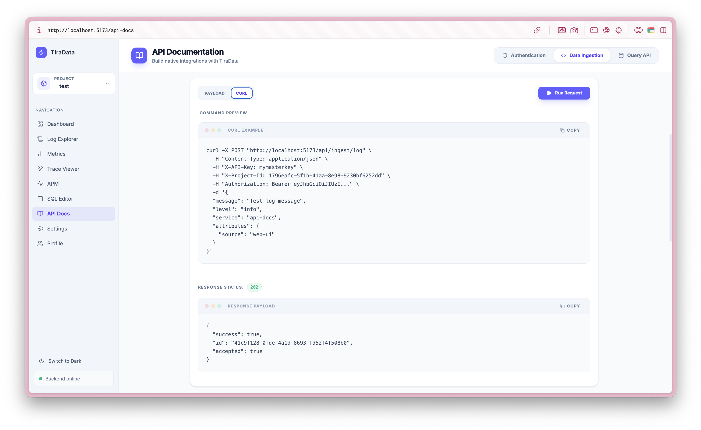

# ⚡ TiraData

> A lightweight, self-hosted alternative to **Datadog** and **Sentry**.  
> Ingest logs, metrics, and traces — then query them with raw SQL.

---

<div align="center">
<table>
<tr>
<td width="50%">

<p align="center"><b>Operational Dashboard</b></p>
</td>
<td width="50%">

<p align="center"><b>APM & Performance</b></p>
</td>
</tr>
<tr>
<td width="50%">

<p align="center"><b>Distributed Tracing</b></p>
</td>
<td width="50%">

<p align="center"><b>Interactive API Playground</b></p>
</td>
</tr>
</table>
</div>
---

## Why TiraData?

TiraData is a **vendor-independent** observability platform built for developers who want the power of Datadog or Sentry without the complexity or cost of SaaS. It provides a unified view of:

- 🪵 **Logs**: Structured logging with real-time tailing.
- 📈 **Metrics**: High-performance time-series data and visualization.
- 🕵️ **Distributed Tracing**: APM with nested timelines and cross-service visibility.
- 🔍 **SQL First**: No proprietary query language. Use raw SQL for everything.

```
    OTLP / SDK / curl
    ↓         ↓
  gRPC      HTTP (Hono)
    ↓         ↓
    Mapper (OTLP)
          ↓
  Normaliser + Validator
          ↓
In-Memory Ring Buffer Queue  ←── backpressure
    ↓  (batch flush every 250ms)
SQLite (WAL mode) / PostgreSQL
    ↓
Query Engine (raw SQL)
    ↓
React Frontend (Dashboard · APM · Logs · SQL)
```

---

## Tech Stack

| Layer              | Technology                              |
| ------------------ | --------------------------------------- |
| Runtime            | [Bun](https://bun.sh)                   |
| HTTP Framework     | [Hono](https://hono.dev)                |
| gRPC Framework     | [@grpc/grpc-js](https://grpc.io)        |
| Database           | SQLite (native) / PostgreSQL            |
| ORM                | [Drizzle ORM](https://orm.drizzle.team) |
| Frontend Framework | React 19 + TypeScript                   |
| Routing            | TanStack Router                         |
| Styling            | Tailwind CSS 4                          |
| SQL Editor         | Monaco Editor                           |

---

## Getting Started

### Prerequisites

- [Bun](https://bun.sh) ≥ 1.x
- Node.js ≥ 18 (for Vite dev server via `concurrently`)

### Install

```bash
bun install
```

### Environment Variables

| Variable           | Default                              | Description                             |
| ------------------ | ------------------------------------ | --------------------------------------- |
| `STORE`            | `sqlite`                             | Storage adapter: `sqlite` or `postgres` |
| `DB_PATH`          | `tiradata.db`                        | SQLite database file path               |
| `DATABASE_URL`     | `postgres://localhost:5432/tiradata` | PostgreSQL connection string            |
| `PORT`             | `3000`                               | Backend port                            |
| `TTL_LOGS_DAYS`    | `30`                                 | Log retention in days                   |
| `TTL_METRICS_DAYS` | `90`                                 | Metric retention in days                |
| `TTL_TRACES_DAYS`  | `7`                                  | Trace retention in days                 |

### Run (Development)

```bash
# Starts frontend (Vite :5173) and backend (Bun :3000 + gRPC :4317)
# Automatically clears ports before starting via 'predev' hook
npm run dev

# Push schema to database
npm run db:push

# Force kill any processes on ports 3000, 4317, 5173
npm run kill
```

| Service              | Port   | Protocol | Description             |
| -------------------- | ------ | -------- | ----------------------- |
| **Frontend UI**      | `5173` | HTTP     | Web Dashboard           |
| **Backend API**      | `3000` | HTTP     | Query, Admin, OTLP/HTTP |
| **OTLP gRPC**        | `4317` | gRPC     | Native Ingestion        |
| **OTLP gRPC (Test)** | `4318` | gRPC     | Test Suite Listener     |

### Run Separately

```bash
# Backend only
npm run dev:backend   # bun --watch src/backend/app.ts

# Frontend only
npm run dev:frontend  # vite
```

---

## Project Structure

```
src/
├── backend/
│   ├── app.ts                              # Entry point + graceful shutdown
│   ├── domain/
│   │   ├── types.ts                        # Core domain types
│   │   ├── id.ts                           # crypto.randomUUID() helper
│   │   ├── ring-buffer.ts                  # O(1) ring buffer (backpressure queue)
│   │   └── store.interface.ts              # IStore — shared adapter contract
│   ├── infrastructure/
│   │   ├── db/                             # Drizzle core
│   │   ├── http/
│   │   │   └── server.ts                   # Hono endpoints
│   │   ├── grpc/
│   │   │   ├── server.ts                   # Native OTLP gRPC listener
│   │   │   └── protos/                     # OTel .proto definitions
│   │   ├── queue/                          # Ring buffer & WAL
│   │   ├── cache/                          # Query result caching
│   │   └── sqlite/postgres/                # Store implementations
│   └── usecases/
│       ├── normalise.ts                    # Payload sanitization
│       ├── otlp-mapper.ts                  # OTLP → Internal mapping
│       ├── alerting-engine.ts              # Background rule checker
│       └── ttl-job.ts                      # Rentention manager
└── frontend/
    ├── components/
    │   └── Sidebar.tsx                     # Nav sidebar with backend health indicator
    ├── routes/
    │   ├── __root.tsx                      # App shell layout
    │   ├── index.tsx                       # Dashboard
    │   ├── logs.tsx                        # Log Explorer
    │   ├── metrics.tsx                     # Metrics Chart
    │   ├── traces.tsx                      # Trace Viewer
    │   └── query.tsx                       # SQL Editor
    └── utils/
        ├── api.ts                          # Typed API client
        └── format.ts                       # Formatters (timestamps, durations, counts)
```

---

---

## Native OpenTelemetry Support

TiraData acts as a native OTLP receiver. You can point the **OpenTelemetry Collector** or any **OTel SDK** directly to it.

### OTel Collector Configuration

```yaml
exporters:
  otlp/tiradata:
    endpoint: "localhost:4317" # gRPC
    tls:
      insecure: true
    headers:
      X-API-Key: "your_api_key_here"

service:
  pipelines:
    traces:
      exporters: [otlp/tiradata]
    metrics:
      exporters: [otlp/tiradata]
    logs:
      exporters: [otlp/tiradata]
```

### Manual Ingestion (curl)

```bash
# OTLP/HTTP (Logs)
curl -X POST http://localhost:3000/v1/logs \
  -H 'X-API-Key: project_key' \
  -d '{"resourceLogs": [...]}'

# TiraData Custom API (Simpler)
curl -X POST http://localhost:3000/api/ingest/log \
  -H 'X-API-Key: project_key' \
  -d '{"level":"info","message":"hello"}'
```

### Query

```bash
# List logs (supports ?service=&level=&limit=&offset=&from=&to=)
GET /api/logs

# List metrics (supports ?name=&limit=&from=&to=)
GET /api/metrics

# List distinct metric series names
GET /api/metrics/names

# List traces (supports ?trace_id=&limit=&from=&to=)
GET /api/traces

# Execute a SQL SELECT query
POST /api/query/sql
{ "sql": "SELECT level, COUNT(*) FROM logs GROUP BY level" }
```

### Admin

```bash
GET /api/health   # → { status: "ok", time: "..." }
GET /api/stats    # → { logs, metrics, traces, queue, uptime_s }
```

---

## Storage Schema

```sql
CREATE TABLE logs (
  id         TEXT    PRIMARY KEY,
  timestamp  INTEGER NOT NULL,   -- Unix ms
  level      TEXT    NOT NULL,   -- debug | info | warn | error | fatal
  service    TEXT    NOT NULL,
  message    TEXT    NOT NULL,
  attributes TEXT    NOT NULL    -- JSON
);

CREATE TABLE metrics (
  timestamp  INTEGER NOT NULL,
  name       TEXT    NOT NULL,
  value      REAL    NOT NULL,
  labels     TEXT    NOT NULL    -- JSON
);

CREATE TABLE traces (
  trace_id   TEXT    NOT NULL,
  span_id    TEXT    NOT NULL PRIMARY KEY,
  parent_id  TEXT,
  start_time INTEGER NOT NULL,
  duration   INTEGER NOT NULL,   -- ms
  name       TEXT    NOT NULL,
  attributes TEXT    NOT NULL    -- JSON
);
```

**Indexes:** `(timestamp DESC)` on logs and traces, `(name, timestamp DESC)` on metrics, `(trace_id)` on traces.

---

## Performance Design

| Decision                            | Reason                                             |
| ----------------------------------- | -------------------------------------------------- |
| WAL journal mode                    | Non-blocking concurrent reads                      |
| Prepared statements (compiled once) | Avoids re-parsing on every insert                  |
| Batch transactions (up to 500 rows) | Orders-of-magnitude faster than single-row inserts |
| Ring buffer queue (10k capacity)    | HTTP handlers never block on disk I/O              |
| 250ms flush interval                | Balances latency vs throughput                     |
| SELECT-only SQL sandbox             | Safety without a separate query engine             |
| Covering indexes on timestamp       | Fast time-range scans without full-table reads     |

---

## Frontend Pages

| Page             | Route      | Description                                            |
| ---------------- | ---------- | ------------------------------------------------------ |
| **Dashboard**    | `/`        | Live stats, queue utilization, system status           |
| **Log Explorer** | `/logs`    | Filter by service/level/limit, auto-refresh            |
| **Metrics**      | `/metrics` | Multi-series time-series chart (Recharts)              |
| **Trace Viewer** | `/traces`  | Traces grouped by ID, flame-bar timeline               |
| **SQL Editor**   | `/query`   | Monaco editor with `⌘+Enter`, preset queries, TSV copy |

---

## Development Notes

- **Adapter selection**: Set `STORE=postgres` and `DATABASE_URL=postgres://...` to use PostgreSQL. Default is SQLite.
- **Schema management**: Run `npm run db:push` to sync the Drizzle schema to your database. Run `npm run db:studio` to open the visual browser.
- **Backend type-checking**: `src/backend/` is excluded from `tsconfig.app.json` — Bun provides its own globals (`Bun`, `process`). Run backends directly via Bun.
- The SQLite database file (`tiradata.db`) is created in the working directory on first run.
- The ring buffer silently drops items when full and increments `queue.droppedCount`, surfaced at `GET /api/admin/config`.

---

## Roadmap

- [x] **Phase 1** — HTTP ingestion, memory queue, SQLite, SQL query editor, React UI
- [x] **Phase 2** — Drizzle ORM, IStore interface, PostgreSQL adapter (`pg`), TTL cleanup, admin endpoints
- [x] **Phase 2+** — Persistent WAL queue (crash recovery), index optimization
- [x] **Phase 3** — gRPC ingestion, OpenTelemetry native receiver (OTLP/HTTP)
- [x] **Phase 3** — Query result caching, automated background TTL cleanup job
- [x] **Phase 3** — API key authentication, RBAC
- [x] **Phase 4** — Real-time Log Tailing (WebSockets), Alerting Engine, Service Map
- [x] **Phase 5** — Advanced APM (Nested Timelines, Distributed Tracing), Multi-Project Isolation, Dynamic API Keys
